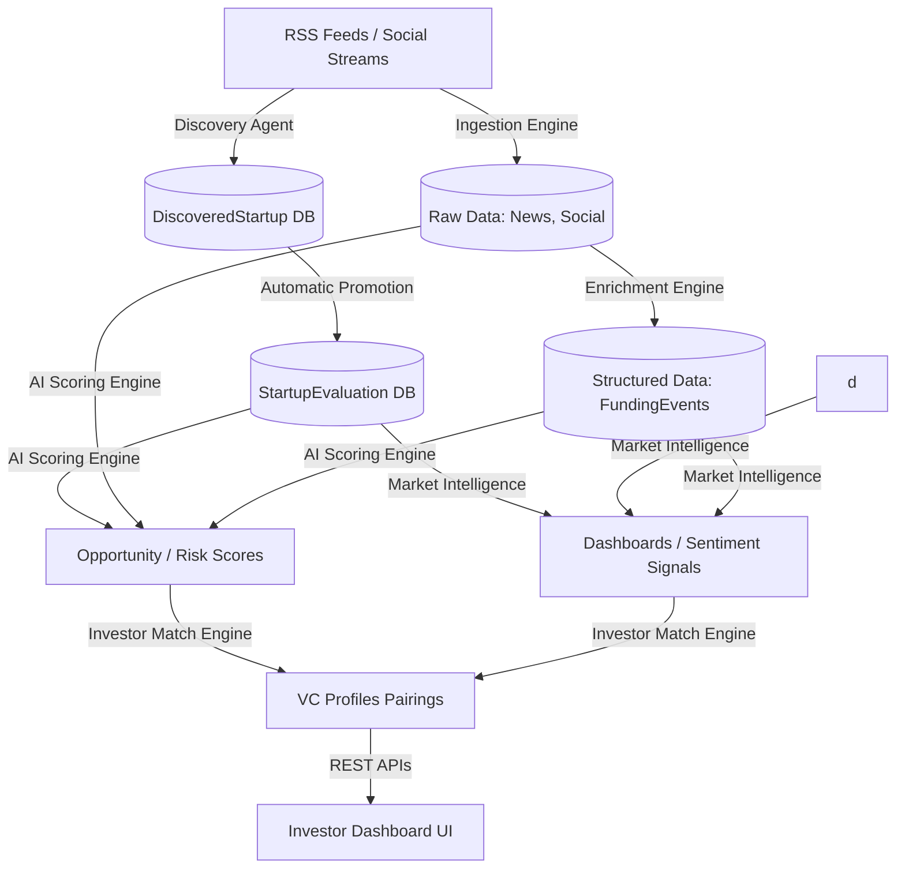

# MatchPoint AI — System Intelligence Documentation

Welcome to the **Behind the Brain** technical documentation for the MatchPoint AI platform. This guide details the Architecture, Database Schemas, API Layer, and Scoring Logic powering the platform's Intelligence Engines.

---

## 🗺️ 1. System Architecture & Data Flow

The platform operates on a continuous **Collect ➔ Enrich ➔ Score ➔ Match** pipeline.

---

## 🗄️ 2. Database Layout (Schemas)

The intelligence layer relies on structured data streams representing live market activity.

### 📡 A. External Signal Trackers (`core/models/ingestion.py`)
| Model | Attribute | Type | Explanation |
| :--- | :--- | :--- | :--- |
| **`NewsArticle`** | `company_name` | Char | The startup linked keyword. |
| | `headline` | Text | Article title matched. |
| | `url` | URL | **Unique** verifiable external resource link. |
| **`SocialSignal`**| `sentiment_score`| Float | 0-100 aggregated continuous public sentiment. |
| | `popularity_score`| Float| 0-100 continuous buzz tracker score. |

### 🧠 B. Intelligence derivative stores (`core/models/matching.py`)
| Model | Attribute | Type | Explanation |
| :--- | :--- | :--- | :--- |
| **`StartupSignal`**| `news_score` | Int | Mentions counted over 30 days window multiplier. |
| | `sentiment_score`| Int | Live percentage overlay on frontend grid maps. |
| | `market_momentum`| Choice| High/Medium/Low label derivation maps. |
| **`StartupInvestorMatch`** | `match_score` | Int | 0-100 alignment matrix total index counter. |
| | `rationale` | Text | Appended readable bullet string justification logs. |

---

## ⚙️ 3. Continuous Execution Engines

### 🤖 A. Startup Discovery Agent
- **Orchestrator Operation**: Triggers sequentially scanning nodes separating stealth releases without manual human entry triggers.
- **Rules Loops**: De-duplicates variables length indexes < 3 or > 80. Creates row promos inside evaluation tables appending ` automatic_discovery = True ` variables inside nested JSON dictionaries.

### 🔬 B. AI Opportunity Scoring
Calculates true opportunity weights referencing coefficients:
- **Base Questionnaire**: Locks directly up to 50% benchmarks.
- **Co-Founders Checklist**: Awards triggers appending weighted loops **+10 Points**.
- **Social Overlays**: Direct multipliers appending **+15 Points** high threshold passes.

---

## 🌐 4. API Endpoints Reference

All frontend analytics pull resolved models securely via standardized interfaces.

| Endpoint Route | Method | Payload Sample |
| :--- | :--- | :--- |
| `/api/v1/startups/<id>/market-intelligence/` | `GET` | `{ "newsScore": 45, "marketMomentum": "High" }` |
| `/api/v1/startups/<id>/investor-matches-v2/` | `GET` | `[{ "investor": "Sequoia", "match_score": 85 }]` |
| `/api/v1/startups/<id>/news/` | `GET` | `[{ "headline": "...", "url": "TC.com/..." }]` |

*(All logic files supporting continuous triggers operate nested strictly inside `backend/core/services/*` directories.)*
