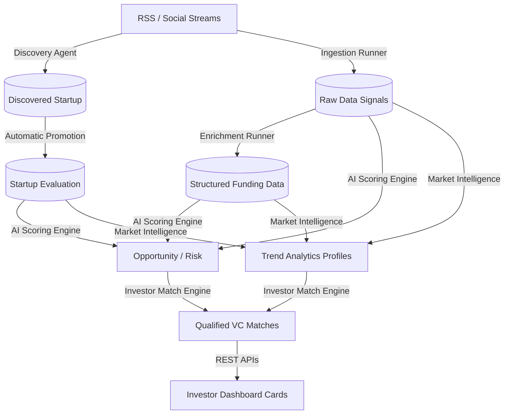

# 🗺️ Deep Dive: MatchPoint AI System Overview

The core intelligence workflow operates on a strict **Ingest ➔ Enrich ➔ Score ➔ Match** pipeline continuous loop backend securely resolving optimal metrics setup boards securely.

---

## 📡 1. The Continuous Pipeline

---

## 🧠 2. Continuous Execution Cycles

Continuous background tasks run seamlessly powering intelligence derivative recalculations safe buffers.

| Job Name | Frequency Cycle | Purpose |
| :--- | :--- | :--- |
| **Ingestion Runner** | 🔄 24 Hours | Pulls raw news RSS streams continuous loops safely. |
| **Enrichment Runner** | 🔄 1 Hour | Extracts strict numeric structures loads nodes arrays. |
| **Autonomy Discovery** | 🔄 12 Hours | Populates unique stealth releases automatically. |
| **Scoring Loops** | 🔄 On change triggers | Derives aggregates metrics targets concurrently. |

---

## 🌐 3. APIs Delivery

All frontend visual components pull resolved continuous state securely via standardized endpoint interfaces:

-   `/api/v1/startups/<id>/market-intelligence/`
-   `/api/v1/startups/<id>/investor-matches-v2/`
-   `/api/v1/ai-opportunities/`

*(For granular description on exact logic formulation nodes, consult the respective module guides inside the folder layout).*
